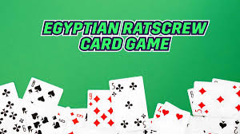

# AS9: Custom Data-Oriented Entity-Component Game: Egyptian Rat Slap!

Authored by Marlo Ongkingco for CS381 (Game Engine Architecture)

## Instructions

In order to run this assignment:

1. In a terminal, move into a directory that you want to copy this assignment in.
2. Run the following command to clone this repository:

   > git clone https://github.com/Marlo-Ong/cs381-game-architecture.git
   >
3. Move into the as9 and fetch the raylib submodule:

   > cd cs381-game-architecture/as9

   > git submodule update --init --recursive

4. Create a build folder, move into it, and compile:

   > mkdir build

   > cd build

   > cmake ..

   > make

5. If it compiled successfully (this may take a bit), an executable should be created, which you can run with the following command:

   > ./as9

6. Once the executable is run, a window should open. Use your keyboard and mouse to control.

## Rules

Egyptian rat-slap is a 4+ player game where you get the most cards as possible. You win by getting the entire deck. At the beginning, the 52-card deck is split evenly amongst all players. Players cannot see their own hand nor other players' hands as they will all be held face-down. In a clockwise order, players place the top card of their hand face-up onto the middle deck until a certain condition (modifier) is met:

1. A face card is placed down:
   - If a player plays a face card, the next person in the order must place X amount of cards sequentially:
      - Ace: 4 cards
      - King: 3 cards
      - Queen: 2 cards
      - Jack: 1 card
   - If the next person does not also place down a face card in X amount of cards, the player who placed the face card gains the entire deck up to that point, and adds it to their hand.

1. A SLAP-pable condition occurs:
   - If two cards of the same value are placed down sequentially, any player can SLAP the deck.
   - If a "sandwich" occurs (two cards of the same value are separated by one card), any player can SLAP the deck.
   - The first person to SLAP the deck will gain the entire deck up to that point.
   - If a player SLAPs the deck without meeting the above conditions (false slap), then they must "burn" the top card of their hand (place it in the bottom of the deck). 
   - The first player who correctly SLAPs must start the round again by placing the first card.

Additionally, here is an image summarizing the basic rules of Egyptian Rat-Slap:

## Controls

- (Keyboard and mouse format)

- Press **left-click** with the mouse to place down a card on to the deck.
   - (You can only perform this when a player's hand is white) 
   - (Basically, keep clicking on the deck image that is white)

- Press **spacebar** with the keyboard to SLAP!
   - (You can only perform this when there are at least 3 cards on the deck)
   - SLAPPING the deck without a valid condition will "burn" the top card of the current player.
   - SLAPPING the deck correctly will add the entire deck to the current player's hand.

## Description of criterion

- **Must be implemented using DOECS**:
   - Is implemented using DOECS
   - Commonly uses card, deck, and player components and manipulates their data with the following systems

- **Must be interactable**:
   - Can use mouse to interact with hand of cards
   - Can use keyboard to perform certain actions

- **Must Draw Model or Play Sound**:
   - Plays background music and SFX :)

- **Must Display Text**:
   - Displays hand/deck size as dynamic text
   - Displays FPS

- **Description of criterion**:
   - Describes criterion
   - When the criterion is described

- **Window named AS9**:
   - The window is named AS9

- **Minimum 2 System not Proposed in Class**:
   - System 1: CardRandomAssignment
   - System 2: TextUpdater

- **Read Me (with Pictures)**:
   - The README has multiple pictures :)

- **EC: Grade Yourself**
   - I will get a 100% as my assignment fulfills all the requirements of the criterion :)

- **EC: Additional Systems**
   - Additional system 1: SlapSystem
   - Additional system 2: GameOverChecker
   - Additional system 3: HandClick 

- **EC: Must be custom made**
   - +5 sound (place.mp3)

- **EC: Must respond to mouse**
   - Clicking a player's hand allows you to place a card